# March Madness 2017 and Predictive Analytics
Jared Endicott  
Tuesday, March 14, 2017  

<div style="width:450px; height=300px">

</div>
<br>


### From March Apathy to March Madness


When it comes to college basketball I'm about as ignorant as they come. I have a vague awareness of March Madness and the Final Four, mostly through tangential knowledge like President Obama filling out a tournament bracket each year and Warren Buffet offering a billion dollar prize for a perfect bracket prediction in 2014. I have never filled out a bracket before. I have never even watched an NCAA game before. I couldn't tell you about the teams or the players. That all changes this year. 

I have been challenged by the idea of using predictive analytics to fill out the 2017 March Madness brackets. To train for this effort I have watched about a dozen lectures on the topic...well...I have watched the same lecture about a dozen times. The talk in question is from a **Great Courses** lecture series called *Big Data: How Data Analytics Is Transforming the World* and it is appropriately titled "<a href="https://www.thegreatcoursesplus.com/big-data-how-data-analytics-is-transforming-the-world/bracketologythe-math-of-march-madness/" target="_blank">Bracketology-The Math of March Madness</a>." In the lecture, Professor Tim Chartier explains some basics about the tournament and then proceeds to lay out a particular data-centered approach to forecasting which teams will win which playoff games. 

Professor Chartier demonstrates the <a href="http://public.gettysburg.edu/~cwessell/RankingPage/massey.pdf" target="_blank">Massey Method</a>, an algorithm created by mathematics professor Kenneth Massey for ranking NCAA college football teams for the Bowl Championship Series. The method can be applied to college basketball as well, and uses game data from the regular season to rank all of the teams. Whoever has the highest rank in any given matchup is favored to win that matchup and the algorithm assumes the winner of any matchup to be the higher ranking team. The algorithm takes into account the point spreads in each of the regular season games, such that winning team has a positive score and losing team has a negative score, and then it uses these to weight the winners and losers by their net score differentials for the season. Point spreads can be capped, so that blowouts and teams who have easier schedules don't overweight the rankings. The method also accommodates various approaches for weighting the games themselves, such as weighting away and neutral territory games higher than home games and/or weightings more recent games higher than games earlier in the regular season. All in all, this algorithm looks like it could be a scoring leader.

The data for this analysis was made available by **Kaggle** in the form of CSVs. Kaggle is a website that hosts data science competitions, including an annual <a href="https://www.kaggle.com/c/march-machine-learning-mania-2017/" target="_blank">March Machine Learning Mania</a> for the NCAA March Madness Tournament. As cited by Kaggle the data is ultimately provided by Kenneth Massey himself. 


### Calculate NCAA Rankings

I used R, a preferred language for data scientists, to write a function that will calculate NCAA basketball team rankings using the Massey Method as explained by Professor Chartier. This algorithm follows this general recipe for calculating the rankings using a linear system:

1) Calculate each team's net point spread from the regular season games and save these in a vector (V).
2) Calculate a winning team by losing team matrix (M) that has the amount of games each team has played as well as a multiple of -1 for each matchup between the same two teams.
3) Solve the equation M * Rankings = V, where the teams in V are aligned with the teams in the rows of M.
4) Calculate the inverse of M.
5) Multiply the inverse of M by V to get the rankings.

For a more in depth understanding of the mathematical ideas behind this algorithm I suggest acquiring Professor Chartier's lectures on *Big Data* from The Great Courses.

The R function below may not be too pretty, but it gets the jobs done and returns a list of rankings. There are various parameters that can be passed to the function. These parameters include the year to calculate the rankings for, a cap for each game's point spread, a weight for away games, and weights for games played in different quarters of the season. There is also a parameter that will allow me to set a number of randomly chosen upsets in round 1, such that a lower ranked team will beat the higher ranked team in that game. These parameters allow for new rankings to be calculated very quickly under different scenarios.


```r
# load libraries
library(dplyr)
library(reshape2)
library(MASS)
library(TeachingDemos)
library(png)
```


```r
GetNCAARankings <- function(myYear, myScoreCap, myLocMod
                            , myQ1Mod, myQ2Mod, myQ3Mod, myQ4Mod){
# this function calculates and returns NCAA rankings 
# for a given regular season and set of parameters        
        
        #set file paths
        fp.RegularSeasonCompactResults <- 
                'C:/Users/Jared/Documents/R/MarchMadness/RegularSeasonCompactResults.csv'
        fp.Teams <- 
                'C:/Users/Jared/Documents/R/MarchMadness/Teams.csv'
        
        # load files into data frames
        data.RegularSeasonCompactResults <- read.csv(fp.RegularSeasonCompactResults)
        data.Teams <- read.csv(fp.Teams)
        
        
        # filter, mutate, and arrange dataset
        data.quarter <- data.RegularSeasonCompactResults %>%
                filter(Season == myYear)
        
        q1 <- (max(data.quarter$Daynum) - min(data.quarter$Daynum)) / 4
        q2 <- (max(data.quarter$Daynum) - min(data.quarter$Daynum)) / 2
        q3 <- ((max(data.quarter$Daynum) - min(data.quarter$Daynum)) / 2) + 
                ((max(data.quarter$Daynum) - min(data.quarter$Daynum)) / 4)
        
        
        # filter, mutate, and arrange dataset
        data.wins <- data.RegularSeasonCompactResults %>%
                filter(Season == myYear) %>%
                mutate(counter = 1) %>%
                mutate(ScoreDiff = Wscore - Lscore) %>%
                mutate(ScoreDiff = ifelse(ScoreDiff >= myScoreCap, myScoreCap, ScoreDiff)) %>%
                mutate(ScoreDiff = ifelse(Wloc == 'A|N', ScoreDiff * myLocMod, ScoreDiff))
        
        data.wins <- data.wins %>%
                mutate(ScoreDiff = 
                        ifelse(Daynum <= q1
                               , ScoreDiff * myQ1Mod
                               , ifelse(Daynum <= q2
                                        , ScoreDiff * myQ2Mod
                                        , ifelse(Daynum <= q3
                                                , ScoreDiff * myQ3Mod
                                                , ScoreDiff * myQ4Mod)))) %>%
                group_by(Wteam) %>%
                summarise(ScoreDiff = sum(ScoreDiff), Games = sum(counter)) %>%
                arrange(desc(ScoreDiff))
     
        # filter, mutate, and arrange dataset
        data.losses <- data.RegularSeasonCompactResults %>%
                filter(Season == myYear) %>%
                mutate(counter = 1) %>%
                mutate(ScoreDiff = Lscore - Wscore) %>%
                mutate(ScoreDiff = ifelse(ScoreDiff <= myScoreCap * -1, myScoreCap * -1, ScoreDiff)) %>%
                mutate(ScoreDiff = ifelse(Wloc == 'A|N', ScoreDiff * myLocMod, ScoreDiff))
                
        data.losses <- data.losses %>%
                mutate(ScoreDiff = 
                        ifelse(Daynum <= q1
                               , ScoreDiff * myQ1Mod
                               , ifelse(Daynum <= q2
                                        , ScoreDiff * myQ2Mod
                                        , ifelse(Daynum <= q3
                                                , ScoreDiff * myQ3Mod
                                                , ScoreDiff * myQ4Mod)))) %>%
                group_by(Lteam) %>%
                summarise(ScoreDiff = sum(ScoreDiff), Games = sum(counter)) %>%
                arrange(desc(ScoreDiff))        
                                
        # change the Wteam and Lteam field names to be Team_Id
        names(data.wins)[1] <- 'Team_Id' 
        names(data.losses)[1] <- 'Team_Id'
        
        # bind the wins and losses and then summarise final scores differences
        data.sum <- rbind(data.wins, data.losses)
        data.sum <- data.sum %>%
                group_by(Team_Id) %>%
                summarise(ScoreDiff = sum(ScoreDiff))
        
        # create a data frame with teams and all zeroes to use as a 
        # base to build the score difference vector
        data.sum.base <- data.frame(Team_Id = as.character(data.Teams$Team_Id)
                                    , ScoreDiff = as.numeric(0))
        rownames(data.sum.base) <- data.sum.base$Team_Id
        
        # load the data frame with the cumulative score differences for each team
        for(i in 1:nrow(data.sum)){
                Tid <- as.character(data.sum[i, 1])
                TScoreDiff <- data.sum[i, 2]
                data.sum.base[Tid, 2] <- TScoreDiff
        }
        
        # create a data frame with all zeroes 
        # to use for building a matrix of matchups
        data.mat.base <- data.frame(Wteam = as.character(data.Teams$Team_Id)
                                    , Lteam = as.character(data.Teams$Team_Id)
                                    , Games = as.numeric(0))
        data.mat.base <- dcast(data.mat.base, Wteam ~ Lteam, fill = 0)
        rownames(data.mat.base) <- data.mat.base$Wteam
        drops <- c('Wteam')
        data.mat.base <- data.mat.base[ , !(names(data.mat.base) %in% drops)]
        
        # create a data frame with the count of games played by team
        data.games <- rbind(data.wins, data.losses)
        data.games <- data.games %>%
                group_by(Team_Id) %>%
                summarise(Games = sum(Games)) 
        
        # load the matrix with the number of games played by each team 
        # corresponding to cells where teams intersect themselves
        for(i in 1:nrow(data.games)){
                Tid <- as.character(data.games[i, 1])
                Tgames <- data.games[i, 2]
                data.mat.base[rownames(data.mat.base) == Tid
                              , colnames(data.mat.base) == Tid] <- Tgames
        }
        
        # filter, mutate, and arrange dataset
        data.matchups <- data.RegularSeasonCompactResults %>%
                filter(Season == myYear) %>%
                mutate(counter = -1) %>%
                group_by(Wteam, Lteam) %>%
                summarise(Matchups = sum(counter))
        
        # load the matrix based on the number of matchups between each team
        for(i in 1:nrow(data.matchups)){
                Wtid <- as.character(data.matchups[i, 1])
                Ltid <- as.character(data.matchups[i, 2])
                Tmatch <- data.matchups[i, 3]
                data.mat.base[rownames(data.mat.base) == Wtid
                             , colnames(data.mat.base) == Ltid] <- Tmatch        
                data.mat.base[rownames(data.mat.base) == Ltid
                             , colnames(data.mat.base) == Wtid] <- Tmatch                   
        }
        
        # change data frame into a matrix
        data.mat <- as.matrix(data.mat.base)
        
        # create rankings by calculating the inverse of the matrix
        # then multiplying the inverted matrix by the vector of 
        # cumulative score differences
        rankings <- round(ginv(data.mat) %*% data.sum.base[, 2], 3)
        
        # create a dataset with rankings and sort it
        data.rank <- cbind(data.Teams, rankings)
        data.rank <- arrange(data.rank, desc(rankings))
        
        return(data.rank)
             
}
```


### Simulate March Madness

This next chunk of code simulates the March Madness tournament, starting with 64 teams and simulating matchups in each subsequent round until there is one champion. The outcomes of the games are determined by the rankings that we calculated previously, such that for each matchup the team with the higher ranking is presumed to win.  


```r
SimulateMarchMadness <- function(myData, myYear, myUpsets, coinFlip = FALSE){
# this function takes some NCAA rankings data and 
# uses it to predict March Madness brackets         
        
        # set file paths and get the data
        fp.seeds <- 
                'C:/Users/Jared/Documents/R/MarchMadness/TourneySeeds.csv'
        fp.slots <- 
                'C:/Users/Jared/Documents/R/MarchMadness/TourneySlots.csv'
        
        # load files into data frames
        data.seeds <- read.csv(fp.seeds)
        data.slots <- read.csv(fp.slots)
        
        # filter datasets for selected year
        data.seeds.curr <- data.seeds %>%
                filter(Season == myYear)
        data.slots.curr <- data.slots %>%
                filter(Season == myYear)
              
        # pick random upset games - but exclude the first seed games
        gamesFilter <- c(1:32)[-c(1, 9, 17, 25)]
        upsetGames <- sample(gamesFilter, myUpsets, replace=F)
        
        # create a NULL variable to hold the tournament outcomes
        data.tournament.sim <- NULL
        
        # loop to simulate tournament rounds
        for(r in 1:7){
                if(r == 1){
                        data.seeds.round <- data.seeds.curr[grepl('a|b'
                                                  , data.seeds.curr$Seed), ]
                        names(data.seeds.round)[3] <- 'Team_Id'
                        data.seeds.round <- merge(data.seeds.round
                                                  , myData, sort = FALSE)
                } else if(r == 2){
                        data.seeds.round <- data.seeds.curr[!grepl('a|b'
                                                  , data.seeds.curr$Seed), ]
                        names(data.seeds.round)[3] <- 'Team_Id'
                        data.seeds.round <- merge(data.seeds.round
                                                  , myData, sort = FALSE)   
                        data.seeds.round <- rbind(data.seeds.round
                                                  , data.tournament.sim)  
                        data.tournament.sim <- data.seeds.round
                } else {
                        data.seeds.round <- data.tournament.sim
                }
                
                if(r == 1){
                       for(i in 1:nrow(data.seeds.round)){
                               if(i %% 2 != 0){
                                       t1 <- data.seeds.round[i, ]
                                       t2 <- data.seeds.round[i+1, ]
                                if(coinFlip == TRUE){
                                       coin <- sample(1:2, 1, FALSE)
                                         if(coin == 2){
                                                data.tournament.sim <- 
                                                  rbind(data.tournament.sim, t2)   
                                         } else {
                                                data.tournament.sim <- 
                                                  rbind(data.tournament.sim, t1)                                      
                                                }
                                          }else if(t1$rankings >= t2$rankings){
                                                data.tournament.sim <- 
                                                  rbind(data.tournament.sim, t1)   
                                                } else {
                                                data.tournament.sim <- 
                                                  rbind(data.tournament.sim, t2)                                      
                                                }
                               }
                       }
                       
               # remove a and b designations from the seed names
               data.tournament.sim$Seed <- gsub('a|b'
                                           , ''
                                           , data.tournament.sim$Seed)
                       
                } else {
                        data.slots.round <- data.slots.curr[grepl(paste('R', r-1, sep = '')
                                                                  , data.slots.curr$Slot), ]
                        
                        for(i in 1:nrow(data.slots.round)){
                                strong <- as.character(data.slots.round$Strongseed[i])
                                weak <- as.character(data.slots.round$Weakseed[i])
                                slot <- as.character(data.slots.round$Slot[i])
                                t1 <- data.seeds.round[data.seeds.round$Seed == strong, ]
                                t2 <- data.seeds.round[data.seeds.round$Seed == weak, ]
                                if(coinFlip == TRUE){
                                        coin <- sample(1:2, 1, FALSE)
                                         if(coin == 2){
                                                t2$Seed <- slot
                                                data.tournament.sim <- 
                                                rbind(data.tournament.sim, t2)    
                                         } else {
                                                t1$Seed <- slot
                                                data.tournament.sim <- 
                                                rbind(data.tournament.sim, t1)                                      
                                        }
                                } else if(r == 2 && i %in% upsetGames){
                                        if(t1$rankings >= t2$rankings){
                                                t2$Seed <- slot
                                                data.tournament.sim <- 
                                                rbind(data.tournament.sim, t2)    
                                         } else {
                                                t1$Seed <- slot
                                                data.tournament.sim <- 
                                                rbind(data.tournament.sim, t1)                                      
                                        }
                                        
                                } else {
                                        if(t1$rankings >= t2$rankings){
                                                t1$Seed <- slot
                                                data.tournament.sim <- 
                                                rbind(data.tournament.sim, t1)   
                                         } else {
                                                t2$Seed <- slot
                                                data.tournament.sim <- 
                                                rbind(data.tournament.sim, t2)                                      
                                        }
                                }
                        }
                }     
        }   
        
        write.csv(data.tournament.sim
                  ,paste('C:/Users/Jared/Documents/R/MarchMadness/Bracket_'
                         , myYear
                         ,'.csv'
                         , sep = ''))
                
        return(data.tournament.sim)
        
}
```


### Simulate 2015 and 2016 Brackets to Test Model

We can set parameters for the bracket calculations, including the year of the NCAA tournament we want to predict. Below I set the year to 2015. I set the score cap at 100, which essentially means no real cap on point spreads. Neutral location and away games are weighted 2 to 1 versus home games. I set equal weights for games at different times in the season and I set the random upsets to 0. Let's see what bracket the algorithm simulates with these parameters for 2015.


```r
# set parameters
parYear <- 2015
parScoreCap <- 100
parLocMod <- 2
parQ1Mod <- 1
parQ2Mod <- 1
parQ3Mod <- 1
parQ4Mod <- 1
parUpsets <- 0

# get the rankings
ranks <- GetNCAARankings(parYear, parScoreCap, parLocMod, 
                           parQ1Mod, parQ2Mod, parQ3Mod, parQ4Mod)
# run the simulation
sim <- SimulateMarchMadness(ranks, parYear, parUpsets)

# create the bracket visual
MarchMadnessBracket(sim, parYear)
```

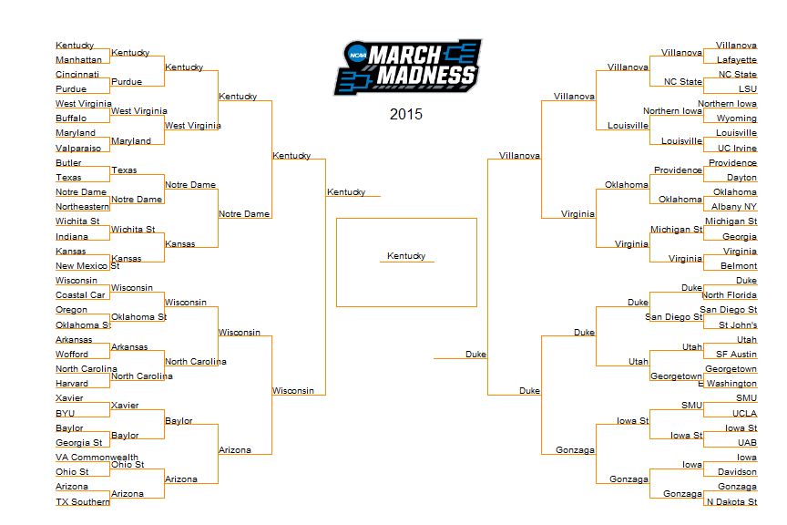 

For 2015 I scored fairly well, with 1080 points out of a possible 1920 under ESPNs Tournament Challenge scoring system. For the Final Four, this simulation predicted three of the teams, but in the championship game the model forecast Kentucky to win over Duke, while in reality Duke won over Wisconsin. Let's see how the model performs for 2016, but this time I will cap the score at 17. 


```r
# set parameters
parYear <- 2016
parScoreCap <- 17
parLocMod <- 2
parQ1Mod <- 1
parQ2Mod <- 1
parQ3Mod <- 1
parQ4Mod <- 1
parUpsets <- 0

# get the rankings
ranks <- GetNCAARankings(parYear, parScoreCap, parLocMod, 
                           parQ1Mod, parQ2Mod, parQ3Mod, parQ4Mod)
# run the simulation
sim <- SimulateMarchMadness(ranks, parYear, parUpsets)

# create the bracket visual
MarchMadnessBracket(sim, parYear)
```

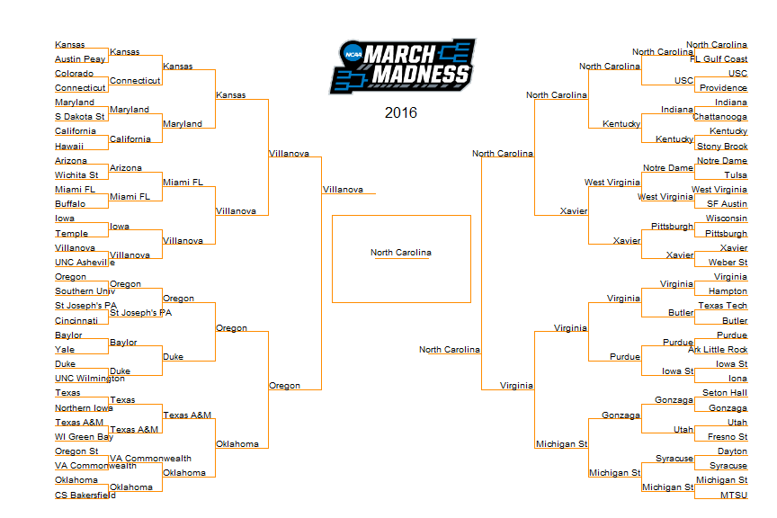 

My score was even better for 2016, with 1170 out of 1920. While I only had two of the Final Four selected correctly, I predicted the championship matchup of Villanova versus North Carolina. However, my model picked North Carolina to win, but they were in fact defeated by Villanova. Next we will move on to simulating the 2017 tournament brackets.

### Simulations for 2017

Since I've already demonstrated the R code for running and visualizing a simulation, I will hide the R code from here on out and just display the bracket predictions. For 2017 I am going to submit my 25 allowable brackets to the ESPN Tournament Challenge. The first 12 of these brackets will be simulations using the ranking model with different parameters. The next 12 brackets will be coin flip simulations, where each matchup is given a 50/50 random chance. The last remaining bracket will be chosen by my wife Mary based on her own preferences. The first 12 are my model tests, while the next 12 are essentially controls. Presumably the model simulations should perform better than the coin flip simulations.

#### Ranking Model Simulation 1

 * Year = 2017
 * Score Cap = 100
 * Away/Neutral Game Weight = 1
 * Q1 Games Weight = 1
 * Q2 Games Weight = 1
 * Q3 Games Weight = 1
 * Q4 Games Weight = 1
 * Upsets = 0


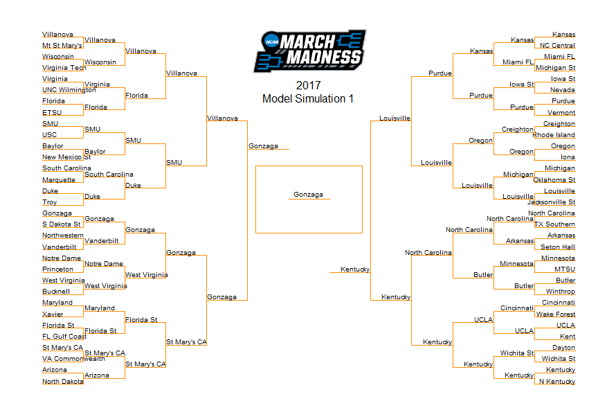 

#### Ranking Model Simulation 2

 * Year = 2017
 * Score Cap = 100
 * Away/Neutral Game Weight = 2
 * Q1 Games Weight = 1
 * Q2 Games Weight = 2
 * Q3 Games Weight = 3
 * Q4 Games Weight = 4
 * Upsets = 0

 

#### Ranking Model Simulation 3

 * Year = 2017
 * Score Cap = 100
 * Away/Neutral Game Weight = 4
 * Q1 Games Weight = 1
 * Q2 Games Weight = 2
 * Q3 Games Weight = 4
 * Q4 Games Weight = 8
 * Upsets = 2

 

#### Ranking Model Simulation 4

 * Year = 2017
 * Score Cap = 100
 * Away/Neutral Game Weight = 4
 * Q1 Games Weight = 1
 * Q2 Games Weight = 4
 * Q3 Games Weight = 16
 * Q4 Games Weight = 64
 * Upsets = 6

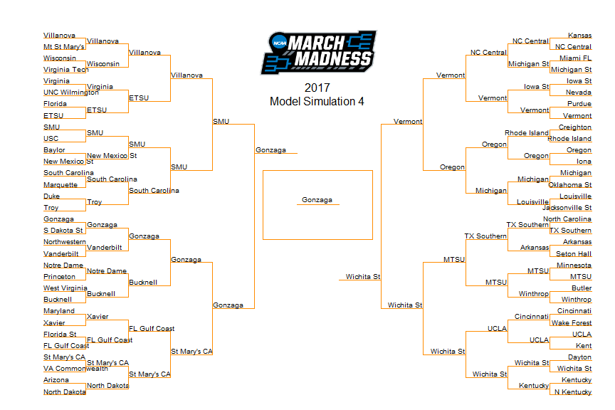 


#### Ranking Model Simulation 5

 * Year = 2017
 * Score Cap = 17
 * Away/Neutral Game Weight = 1
 * Q1 Games Weight = 1
 * Q2 Games Weight = 1
 * Q3 Games Weight = 1
 * Q4 Games Weight = 1
 * Upsets = 0

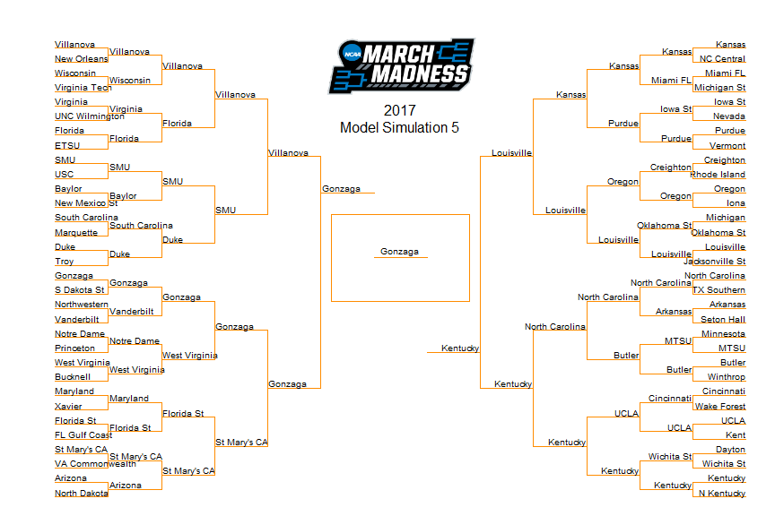 

#### Ranking Model Simulation 6

 * Year = 2017
 * Score Cap = 17
 * Away/Neutral Game Weight = 2
 * Q1 Games Weight = 1
 * Q2 Games Weight = 2
 * Q3 Games Weight = 3
 * Q4 Games Weight = 4
 * Upsets = 0

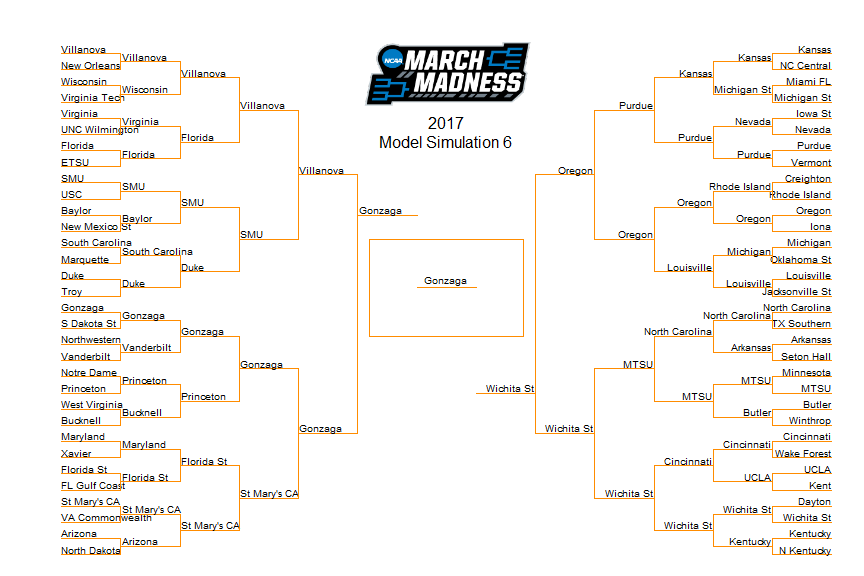 

#### Ranking Model Simulation 7

 * Year = 2017
 * Score Cap = 17
 * Away/Neutral Game Weight = 4
 * Q1 Games Weight = 1
 * Q2 Games Weight = 2
 * Q3 Games Weight = 4
 * Q4 Games Weight = 8
 * Upsets = 2

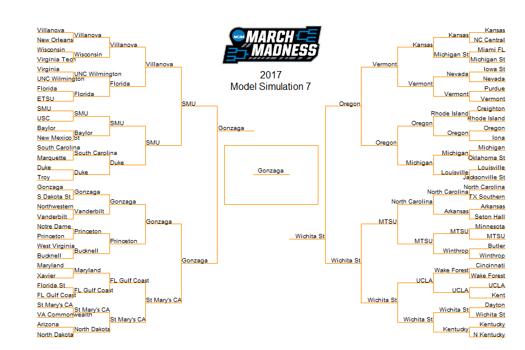 

#### Ranking Model Simulation 8

 * Year = 2017
 * Score Cap = 17
 * Away/Neutral Game Weight = 4
 * Q1 Games Weight = 1
 * Q2 Games Weight = 4
 * Q3 Games Weight = 16
 * Q4 Games Weight = 64
 * Upsets = 6

 

#### Ranking Model Simulation 9

 * Year = 2017
 * Score Cap = 5
 * Away/Neutral Game Weight = 1
 * Q1 Games Weight = 1
 * Q2 Games Weight = 1
 * Q3 Games Weight = 1
 * Q4 Games Weight = 1
 * Upsets = 0

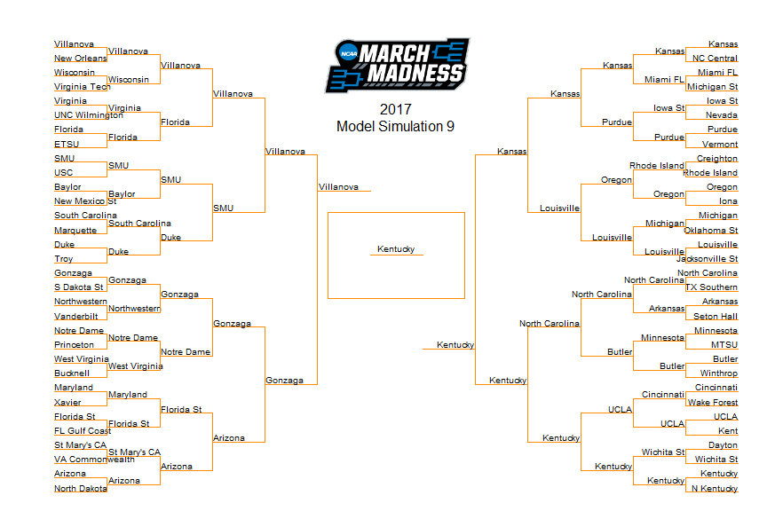 

#### Ranking Model Simulation 10

 * Year = 2017
 * Score Cap = 5
 * Away/Neutral Game Weight = 2
 * Q1 Games Weight = 1
 * Q2 Games Weight = 2
 * Q3 Games Weight = 4
 * Q4 Games Weight = 8
 * Upsets = 0

 

#### Ranking Model Simulation 11

 * Year = 2017
 * Score Cap = 100
 * Away/Neutral Game Weight = 1
 * Q1 Games Weight = 1
 * Q2 Games Weight = 1
 * Q3 Games Weight = 1
 * Q4 Games Weight = 1
 * Upsets = 20

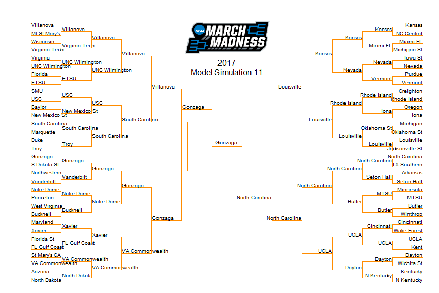 

#### Ranking Model Simulation 12

 * Year = 2017
 * Score Cap = 100
 * Away/Neutral Game Weight = 10
 * Q1 Games Weight = 1
 * Q2 Games Weight = 2
 * Q3 Games Weight = 4
 * Q4 Games Weight = 8
 * Upsets = 6

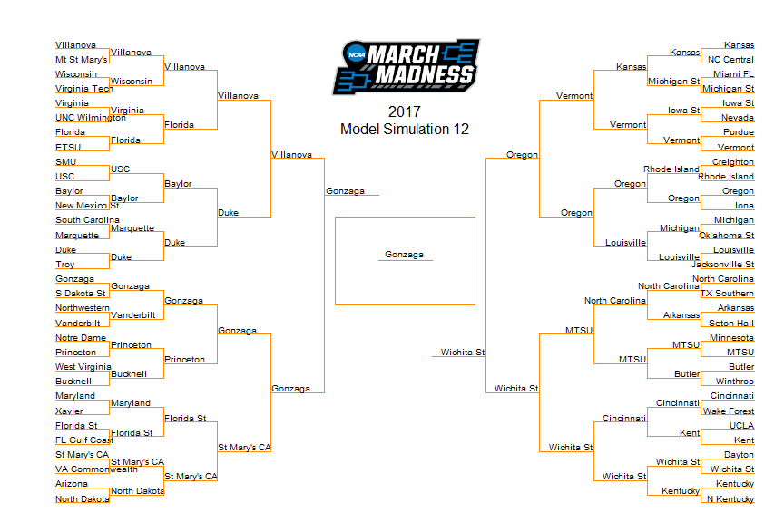 

#### Simulate 2017 Brackets 13 through 24 Using Coin Flips

For the next set of simulations I will be overriding the normal ranking model and use a coin flip method for choosing winners. This feature gives me the ability to create random brackets to act as controls to compare the brackets chosen by the predictive analytics method. This will tell us how well the algorithm for ranking teams performs against random chance, where hopefully it performs much better. Below are my next 12 brackets chosen using a coin clip simulation.


 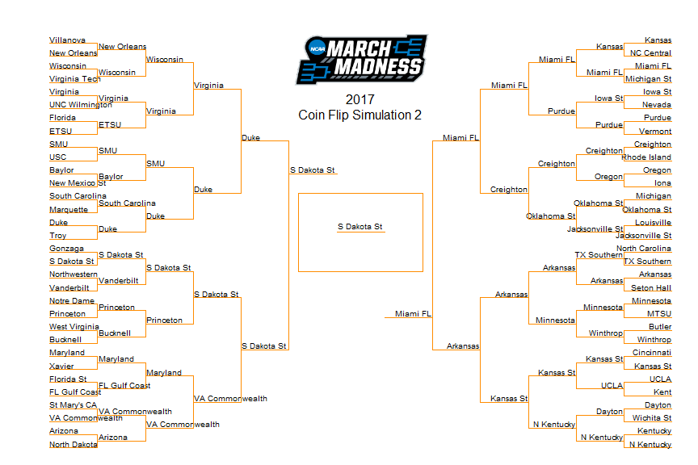  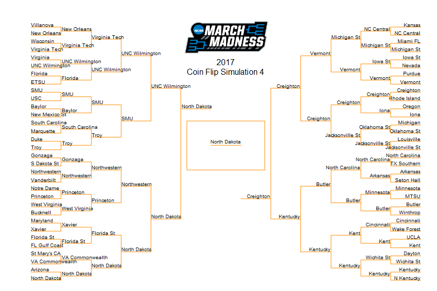      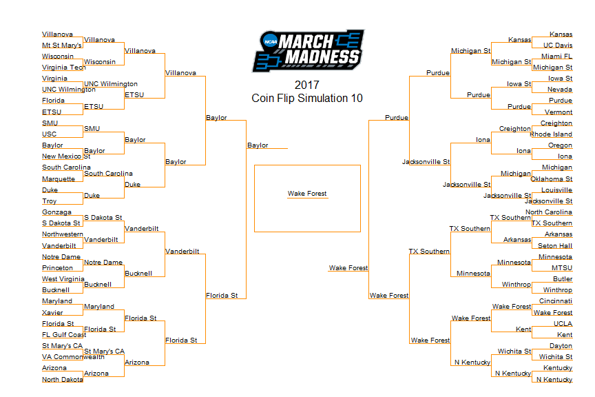 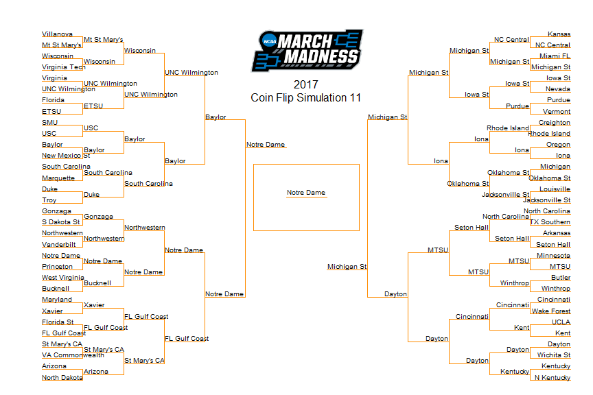 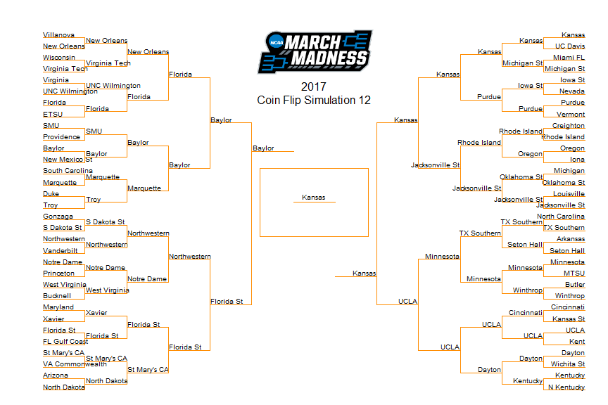 


The brackets created by the ranking model show fairly stable outcomes under diverse parameter assumptions, with Gonzaga predicted to win it all in 9 out of 12 simulations. In the other 3 brackets, Kentucky wins twice and Wichita St wins once. There is more variation in the earlier rounds, with the Final Four matchups composed from combinations of 10 unique teams. The 64 first round games show the most diverse set of potential outcomes across the simulations, and likely this was influence a lot by the addition of the random upsets parameter. It makes sense that the ranking model would be fairly stable, especially when choosing the tournament champion, because the parameters allow for only limited variation in how the rankings are chosen and it will tend to be the case that the highest ranking teams maintain those positions under different parameter scenarios.

This is in stark contrast to the 12 coin flip models, which show significant diversity in the brackets that are simulated. The only team that comes out on top more than once is North Dakota, with the other 10 tournament simulations being split between Oklahoma St, S Dakota St, Villanova, New Mexico St, Butler, Michigan, Florida, Wake Forest, Notre Dame, and Kansas. Anything can happen when the winners and losers are determined by random chance. It will be really interesting to see how the ranking model brackets stack up against the coin flip brackets.


### We Are the Champions

This is where I evalulate the success of these predictive analytics methods at forecasting March Madness brackets. So, more to come after the tournament is over.

Coming Soon...


